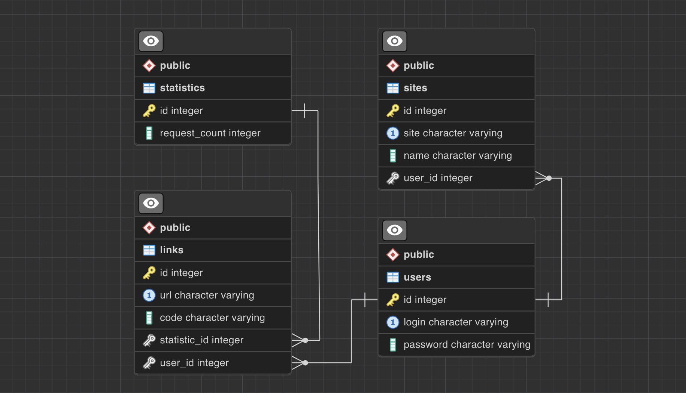
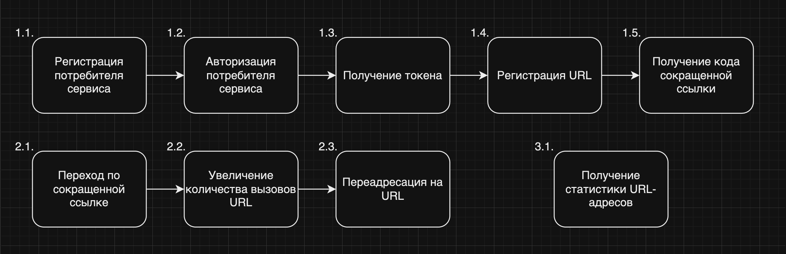
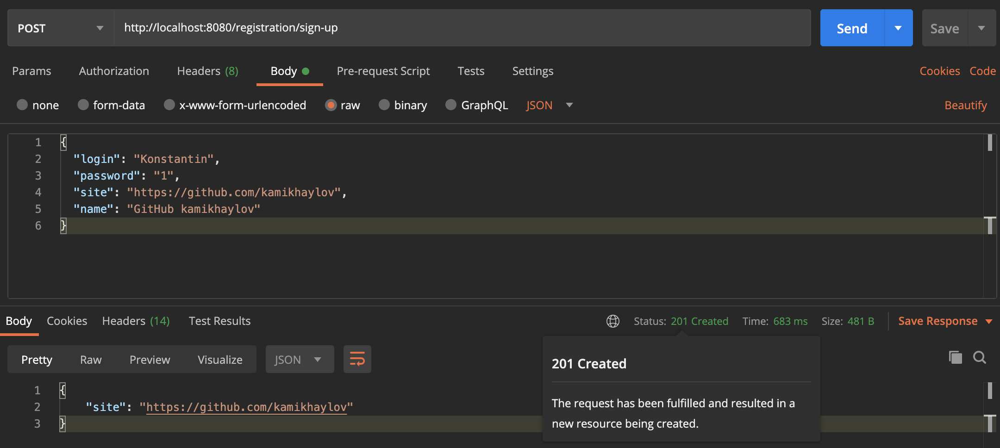
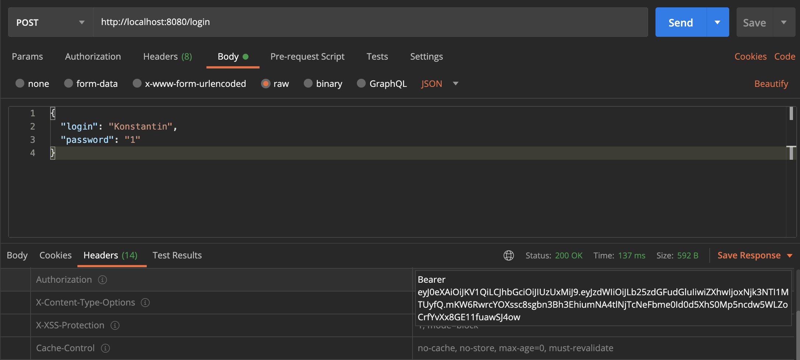
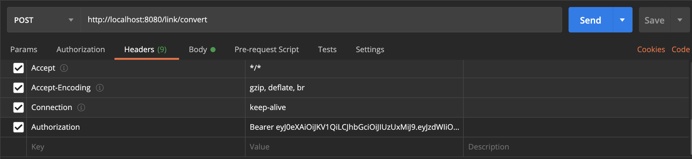
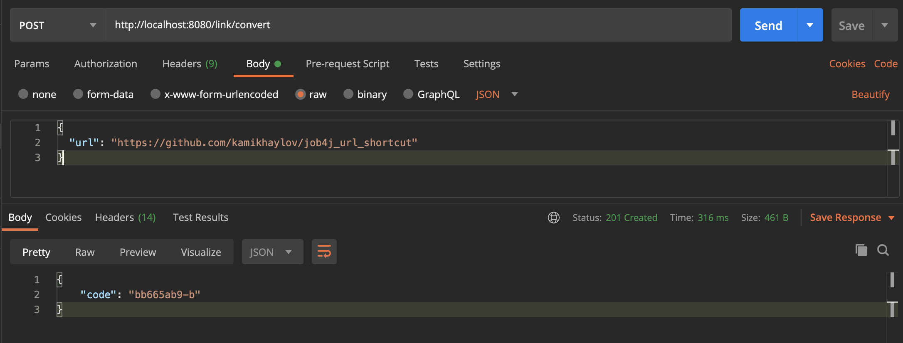
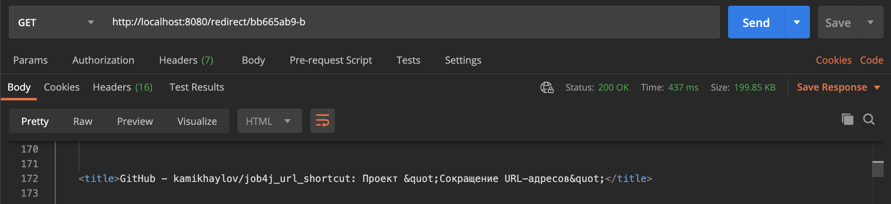
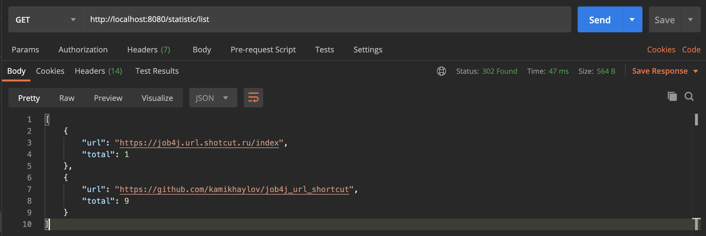

# job4j_url_shortcut
Проект "Сокращение URL-адресов"

[![github actions][actions-image]][actions-url]
[![coverage][codecov-image]][codecov-url]

Сервис для безопасного предоставления сокращенных URL-адресов сайтов.
Работает через REST API.

Сервис предоставляет:
- Регистрацию сайта. Сервисом могут пользоваться разные сайты. Каждому сайту выдается пара логин и пароль.
- Авторизация сайта через JWT.
- Регистрация URL. После того, как пользователь зарегистрировал свой сайт, он может отправлять на сайт
ссылки и получать преобразованные ссылки.
- Переадресация сайта выполняется без авторизации.
- Статистика сайта. В сервисе считается количество вызовов каждого адреса.

### Используемые технологии
- Java 17
- Spring Boot 3.1.4
- Maven 3.8
- Git
- Lombok 1.18.22
- Junit 5

### Требуемое окружение
- JDK 17
- Apache Maven 3.8.5
- PostgreSQL 13
- Браузер

### Подготовка к запуску приложения
- Создать БД accidents хост `jdbc:postgresql://localhost:5432/url_shortcut`
- Собрать jar с приложением, выполнив команду `mvn install`
- Запустить приложение из папки target, выполнив команду: `java -jar job4j_url_shortcut-1.0-SNAPSHOT.jar`

### Таблицы PostgreSQL DB
Таблицы базы данных написаны с помощью Liquibase. Схема БД:

### Процесс сервиса

### 1.1. Регистрация потребителя сервиса

Сервис <b> /registration/sign-up <b>

Контракт запроса:

| body     | Тип                | Обязательность | Наименнование  |
|----------|--------------------|:--------------:|----------------|
| login    | String             |       1        | Логин          |
| password | String             |       1        | Пароль         |
| site     | String             |       1        | Сайт           |
| name     | String             |       1        | Наименнование  |

Контракт ответа:

| body  | Тип                | Обязательность | Наименнование  |
|-------|--------------------|:--------------:|----------------|
| site  | String             |       1        | Сайт           |

Возможные httpStatus - created, conflict

Пример:

`http://localhost:8080/registration/sign-up`

### 1.2. - 1.3. Регистрация потребителя сервиса и получение токена авторизации

Сервис <b> /login <b>

Контракт запроса:

| body     | Тип             | Обязательность | Наименнование  |
|----------|-----------------|:--------------:|----------------|
| login    | String          |       1        | Логин          |
| password | String          |       1        | Пароль         |

Контракт ответа:

| headers       | Тип     | Обязательность | Наименнование     |
|---------------|---------|:--------------:|-------------------|
| Authorization | String  |       0        | Токен авторизации |

Возможные httpStatus - ок, forbidden

Пример:

`http://localhost:8080/login`

### 1.4. - 1.5. Регистрация URL-адреса и получение кода сокращенной ссылки

Сервис <b> /link/convert <b>

Контракт запроса:

| body    | Тип                | Обязательность | Наименнование |
|---------|--------------------|:--------------:|---------------|
| url     | String             |       1        | URL-адрес     |

| headers       | Тип     | Обязательность | Наименнование     |
|---------------|---------|:--------------:|-------------------|
| Authorization | String  |       1        | Токен авторизации |

Контракт ответа:

| body  | Тип                | Обязательность | Наименнование          |
|-------|--------------------|:--------------:|------------------------|
| code  | String             |       0        | Код сокращенной ссылки |

Возможные httpStatus - created, conflict

Пример:

`http://localhost:8080/link/convert`

### 2.1. - 2.3. Переход по сокращенной ссылке
- Переадресация на URL
- Увеличение количества вызовов URL-адреса
- Переадресация на URL-адреса

Сервис <b> /redirect/{code} <b>

Контракт запроса:

| parameters | Тип                | Обязательность | Наименнование          |
|------------|--------------------|:--------------:|------------------------|
| code       | String             |       1        | Код сокращенной ссылки |

Контракт ответа:

Redirect на URL-адреса

Возможные httpStatus - ok, not_found

Пример:

`http://localhost:8080/link/bb665ab9-b`

### 3.1. Получение статистики URL-адресов

Сервис <b> /statistic/list <b>

Контракт ответа:

| body  | Тип          | Обязательность | Наименнование             |
|-------|--------------|:--------------:|---------------------------|
| list  | List<String> |       0        | Список URL-адресов        |
| url   | String       |       1        | URL-адрес                 |
| total | Integer      |       0        | Количество вызовов адреса |

Возможные httpStatus - found

Пример:

`http://localhost:8080/statistic/list`

### Контакты
kanmikhaylov@gmail.com

[actions-image]: https://github.com/kamikhaylov/job4j_url_shortcut/actions/workflows/maven.yml/badge.svg
[actions-url]: https://github.com/kamikhaylov/job4j_url_shortcut/actions/workflows/maven.yml
[codecov-image]: https://codecov.io/gh/kamikhaylov/job4j_url_shortcut/graph/badge.svg?token=
[codecov-url]: https://codecov.io/gh/kamikhaylov/job4j_url_shortcut